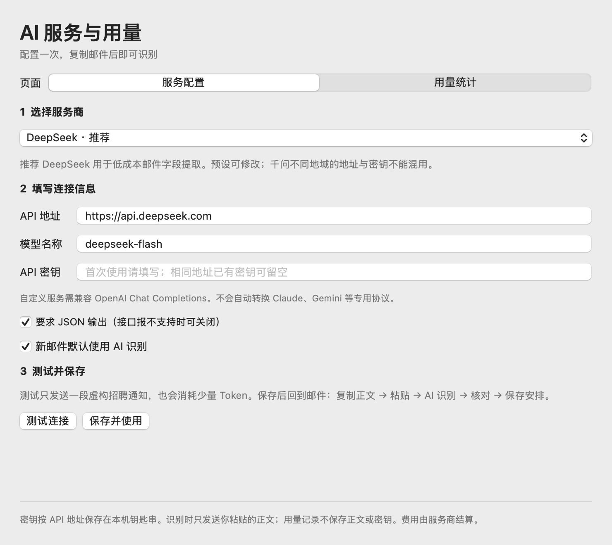
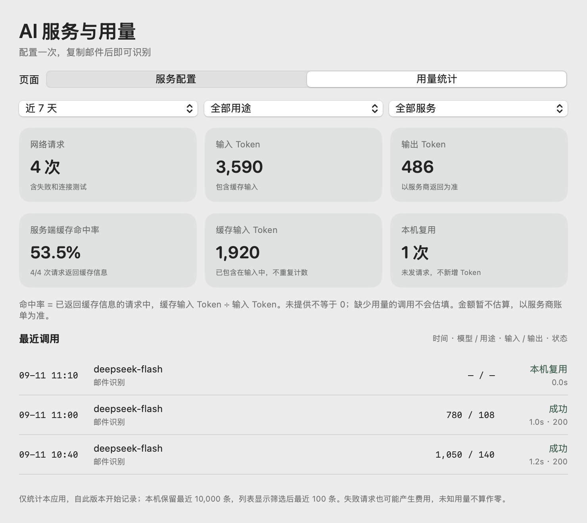
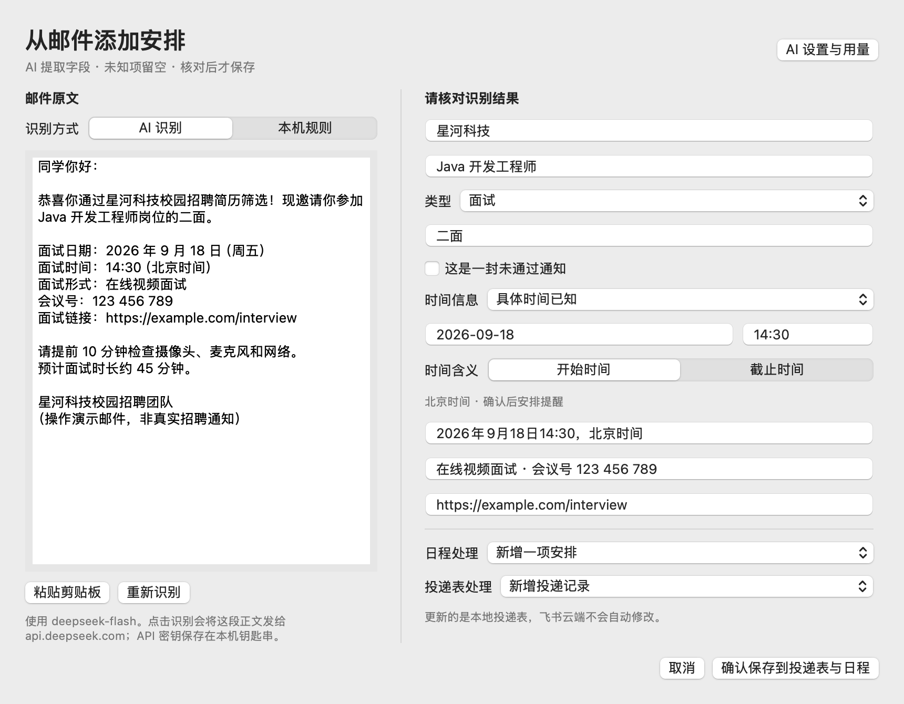
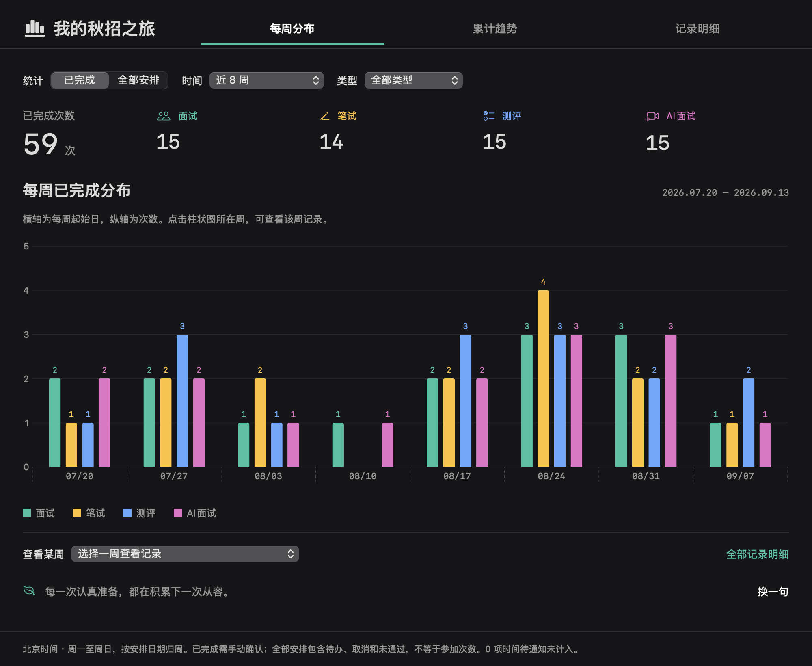

# InterviewBar_MacOS · 面试日程

住在 Mac 菜单栏里的秋招记录本。手动录入或粘贴招聘邮件，把面试、笔试、测评、AI 面试收进同一份日程，再用每周时间轴回看自己的秋招之旅。

**仅限非商业用途，严禁拿去商业盈利。** 使用、修改和分发前请阅读 [LICENSE](LICENSE)。这是源码公开的非商业项目，不是允许商业使用的 OSI 开源项目。

[下载最新安装包](https://github.com/byp411426/InterviewBar_MacOS/releases/latest) · [浏览器扩展安装](BrowserExtension/安装与使用.md) · [数据与隐私](docs/PRIVACY.md)

## 能做什么

- 菜单栏小图标：下一项安排、倒计时、公司搜索、状态与四种类型筛选。
- 手动添加：公司、岗位、轮次、开始/截止时间、地点、链接、备注和提前提醒。
- 邮件识别：主动复制正文后粘贴，使用本机规则或自己配置的 AI 模型提取字段；核对后再写入。
- 未知时间留空：仅有日期或“陆续安排”的通知可保存为待通知，不擅自补成今天或午夜。
- 投递总表与日程明细：本地表格、CSV/TSV 导入、日程 CSV 导出；可填入自己的飞书表格地址查看在线原表。
- **我的秋招之旅**：按周保留全部有日期的安排，分别统计四种类型的已完成次数，内置 **120 条**随机鼓励语，支持“换一句”。
- 可拉伸面板：拖左右边改变宽度，拖底边改变高度，拖底部角同时调整；顶部仍锚定菜单栏。双击调整边缘恢复默认尺寸，尺寸会保存。
- 登录后自动启动，关闭窗口继续驻留，唤醒后刷新菜单栏。

不包含邮箱账号登录、IMAP 自动监控、全邮箱爬取、截图 OCR、飞书自动双向同步或云端账户系统。浏览器扩展是可选的文字采集入口，主流程不依赖它。

## 1. 安装并找到菜单栏图标

发行包适用于 **macOS 13 或以上、Apple Silicon（M 系列）Mac**。Intel 用户可从源码尝试编译，当前未在 Intel 真机验证。

1. 从上方 Releases 下载 `InterviewBar-v0.10.1-macOS-arm64.zip`，解压。
2. 把 `面试日程.app` 拖到当前用户的 `应用程序` 文件夹（路径 `~/Applications`，没有可自行新建），或系统“应用程序”文件夹。
3. 双击打开应用。它主要显示在屏幕最上方菜单栏，不会一直占据 Dock。
4. 点击日历小图标展开日程。第一次安装没有预置他人的投递记录，是空白页面。
5. 图标太靠近刘海时，按住 ⌘ 拖到菜单栏右侧；也可在应用设置中点“恢复到菜单栏右侧”。屏幕空间不足时需要减少其他菜单栏图标。

安装包使用本地临时签名，**没有 Apple Developer ID 公证**。macOS 可能提示无法验证开发者。确认下载来源与校验值后，按系统提示在“系统设置 → 隐私与安全”允许打开；不要关闭整个系统的安全保护。不愿允许时，可按后文从源码自行构建。

更新：先在应用设置中退出，替换应用，再打开。不要删除数据目录；已有日程会继续保留。更新后若钥匙串提示拒绝访问，请在模型设置中重新保存自己的密钥。

## 2. 配置自己的 AI API 密钥

以下截图使用应用真实界面与虚构演示数据。密钥框为空，邮件、招聘记录与 Token 数均仅用于说明操作，不代表真实招聘通知或实际消耗。

推荐先用 **DeepSeek** 做低成本字段提取。应用不附带密钥或免费额度，费用由你与服务商结算；不使用 AI 时仍可手动录入或选择本机规则。

1. 在服务商平台创建你自己的 API Key，确认账户可调用所选模型。
2. 打开邮件识别窗口，点右上角 **AI 设置与用量**。也可从菜单栏底部设置进入。首次使用 AI 会引导打开此页。
3. 在 **服务配置** 选择服务商，应用自动填入 API 地址与模型名。预设和自定义地址均可修改。
4. 在 **API 密钥** 密码框粘贴自己的密钥。同一 API 地址已经保存过密钥时可以留空，换地址需配置对应凭据。
5. 点 **测试连接**：只发送一段虚构招聘通知，验证连接与字段提取，不发送你的邮件。此操作会产生少量 API 消耗，记录在“连接测试”中。
6. 测试正常后点 **保存并使用**。测试不会自动保存配置；保存也不会自动切换去发送正在编辑的邮件。
7. 返回邮件窗口，点 **重新识别**。未知信息仍留空，核对后才保存。



图 1：按页面的 **1 选择服务商 → 2 填写连接信息 → 3 测试并保存** 操作。密钥只填在「API 密钥」密码框，不要填入地址或模型名称。

| 服务商 | 预设 API 地址 | 预设模型名 |
| --- | --- | --- |
| DeepSeek（推荐） | `https://api.deepseek.com` | `deepseek-flash` |
| 千问 / 百炼（中国地域） | `https://dashscope.aliyuncs.com/compatible-mode/v1` | `qwen-plus` |
| Kimi | `https://api.moonshot.cn/v1` | `kimi-k2.6` |
| GLM / 智谱 | `https://open.bigmodel.cn/api/paas/v4` | `glm-4.7-flash` |
| 自定义兼容服务 | 填服务商的 HTTPS API 地址 | 填实际 API 模型名 |

平台登录网页和 API 地址不同，不能把 `platform.deepseek.com` 当作 API 地址。千问不同地域 / 工作空间可能使用不同地址与密钥，请以自己控制台说明为准。预设不是模型可用性的保证，服务商模型、权限与价格可能变化。

自定义服务支持 **OpenAI Chat Completions** 请求协议，不等于任意大模型协议都能使用。地址可以填根域名、版本前缀或完整的 `/chat/completions` 地址；不允许查询参数、内嵌账号密码或跳转。接口不支持 `response_format` 时，关闭 **要求 JSON 输出**，仍会通过提示词要求返回 JSON 并校验结果。更换密钥或设置后应用清空本机识别缓存。

配置与缓存统计的详细口径、各厂商官方文档见 [AI 服务与用量说明](docs/AI-SERVICES.md)。DeepSeek 已做真实 API 验证；千问、Kimi、GLM 已按官方协议做模拟响应测试，尚未使用各自账号做真实调用验证。

### 查看 Token 和缓存

进入 **AI 设置与用量 → 用量统计**，按时间、用途、服务商筛选：

- 网络请求次数，以及输入 / 输出 Token；用量直接读取服务商响应，不按字数猜测。
- 服务端缓存输入 Token 与命中率：只在返回缓存信息的请求中，用缓存输入总量除以输入总量。缓存输入已经包含在输入 Token 中，不重复相加。
- 本机复用次数：相同文本在短时内复用成功识别结果，不发请求、不新增 Token。点“重新识别”会跳过本机缓存。
- 最近调用的模型、用途、耗时、HTTP 状态与成功 / 失败。解析失败也可能产生 Token，会保留已返回的用量。
- 未返回的值显示 **未提供**，与真实的 `0` 区分。页面同时显示多少次请求提供了缓存信息。

只记录此版本之后的本应用调用，本机保留最近 10,000 条；不能读取其他软件用量或补回旧记录。**金额暂不估算，以服务商账单为准。**



图 2：点顶部 **用量统计**，再选择时间、用途和服务。上方是筛选后的汇总，下方逐条显示耗时与状态；本机复用不会增加 API Token。图中的数值为演示数据。

## 3. 从邮件到投递表：每一步怎么做

1. **打开邮件**：在 163、QQ 或其他网页邮箱打开本次招聘通知。
2. **选中文字**：尽量包含公司名、岗位、通知类型、日期、时间、地点与链接；不要把整个收件箱或无关邮件选进去。
3. **复制**：按 ⌘C。仅选中而未复制时，剪贴板仍可能是上一段文字。
4. **粘贴**：点击 Mac 菜单栏的日历图标 → **粘贴识别邮件**。应用读取当前剪贴板并打开识别窗口，先检查左边确实是这封邮件。
5. **AI 识别**：已开启默认 AI 时会自动开始；需要重试时点“重新识别”。更换了正文后，再粘贴并识别。首次使用先按引导配置；也可切换到本机规则，复杂表达需要手动修正。
6. **校对**：右侧确认公司、岗位、类型、轮次、日期和时间，特别检查“开始时间 / 截止时间”。AI 面试是独立类型；普通视频面试仍属于“面试”。
7. **缺失就留空**：例如“9 月 15 日起陆续安排”没有具体时刻，不要编造时间；按“从该日起陆续安排”保存为待通知。岗位、地点或链接没有提供，也可留空。以界面提示修正无法确认的字段。
8. **选择更新对象**：在“日程处理”和“投递表处理”里选择新增记录，或选择对应的已有记录。不要将不同公司的通知合并。
9. **确认保存**：点击 **确认保存到投递表与日程**。只有确认后才写入本机文件，同一段已导入文字会提示重复。
10. **查看结果**：回到日程；或打开“投递总表与日程”查看本地投递表、日程明细。没有完整时间的安排出现在“时间待通知”，不会排定时提醒。



图 3：在邮箱选中正文并按 **⌘C**，到这里点左下角 **粘贴剪贴板**；识别后对照左右两栏。确认日期、时刻、轮次和链接正确，再点右下角 **确认保存到投递表与日程**。需要重新请求 AI 时点 **重新识别**，配置入口在右上角。

AI 可能判断错误。日期、时区和链接最终以原邮件为准；“拒绝/放弃面试”链接不是参加入口。邮件正文中的要求不会被应用当作操作命令执行。

## 4. 手动添加、修改和完成

- 右上角 **＋** 添加安排，填写公司、类型、日期时间、开始/截止含义，其余按需填写，保存即生效。
- 点已有安排查看或编辑；每行的 `…` 可标记已完成、恢复待办、取消安排。
- 完成笔试、测评或面试后，主动点 **标记已完成**，这样才会计入旅程统计。
- 过了时间不会自动删除，也不会自动认定完成；仍保留为“时间已过 · 待确认”。“下一项安排”只选未来待办。
- 已完成、取消、未通过的历史可在“全部”、日程明细与旅程中查看。

## 5. 我的秋招之旅：数据统计图

在菜单栏面板底部点 **秋招之旅**。默认以深色统计看板展示：

- **每周分布**：分类柱状图，面试为绿、笔试为黄、测评为蓝、AI 面试为粉；横轴为每周起始日，纵轴为次数。
- **累计趋势**：四类安排的累计折线图，从所选时间范围第一周开始累计。
- **记录明细**：按周列出公司、岗位、时间和状态，可编辑或标记完成。
- 支持近 8 周、近 12 周与全部时间。近几周截至本周日；选择“全部时间”可包含未来周的安排。没有记录的周补零；周数较多时横向滚动图表。
- “已完成”只统计你手动标记完成的记录；“全部安排”包含待办、完成、取消和未通过，是安排量，不代表参加次数。顶部数字、图例与明细使用同一套筛选。
- 点击图表中某一周，或使用下方“查看某周”，可展开该周记录；类型筛选可聚焦某一类。
- 按北京时间周一至周日、安排日期（开始日或截止日）归周，不是实际完成时刻；提前完成下周截止的测评，计在截止日所在周。
- 没有完整日期时间的待通知记录不计入图表。时间过去后记录不会被删除，也不会自动认定为完成。
- 120 条鼓励语在本机随机选择，点“换一句”不产生 API 请求。



图 4：从菜单栏打开 **秋招之旅**，先选统计口径、时间和类型；再用顶部的 **每周分布 / 累计趋势 / 记录明细** 切换视图。图中是虚构的已完成记录，「已完成」需要你参加后手动标记，不会因时间已过自动计入。

## 5.1 两个桌面玻璃组件

设置 → **桌面小组件…**，分别打开“显示最近安排”和“显示本周统计”：

1. **最近安排**：显示下一项待办的公司、类型、时间与倒计时；面试、笔试、测评、AI 面试均可显示。过了开始/截止时刻会切换下一项，右下角箭头打开详情。
2. **本周统计**：显示本周已完成总数及四类次数，右下角箭头打开完整统计图。
3. **置于其他窗口上方**：开启时作为屏幕悬浮组件；关闭时留在桌面层。拖动组件空白处移动，拖边缘或角等比例缩放。宽高比例固定为 11:7，文字、间距和圆角同步缩放；位置、大小和显示状态会保存。旧版被拉变形的尺寸会自动修正。
4. 点组件右上角 × 隐藏；需要时可在设置重新打开。组件跟随应用驻留，退出应用后消失。登录自启动可在下次登录后恢复它们。
5. 玻璃效果使用 macOS 材质，受壁纸、系统外观及“降低透明度”设置影响。

**发行 ZIP 提供的是应用内桌面组件，不会出现在系统“编辑小组件”库。** 仓库另外包含两种原生 WidgetKit 组件的源码与签名构建脚本；编译已通过，开发者签名、共享容器权限及系统组件库安装尚未验收。原生版需要有效 Apple 开发者签名身份，参见 [原生组件说明](docs/NATIVE-WIDGETS.md)。

## 6. 投递总表、飞书与数据备份

点 **投递总表与日程**：

1. “本地投递表” → “导入 CSV / TSV”，选择从飞书或其他表格导出的 UTF-8 文件，第一行为列名；公司列使用“公司”。导入会替换本地表副本，并保留上一份备份，不修改在线表。
2. “日程明细”可以按状态、类型筛选并导出 CSV；“本地投递表”会接收你确认的邮件更新。
3. “飞书原表”粘贴**你自己的 HTTPS 飞书链接**，点加载后保存地址，登录有权限的账号。该窗口的登录状态与 Chrome 独立；加载不成功可点“浏览器打开”。
4. **在线飞书与本地数据不自动同步。** 在在线页面直接编辑会改飞书原表；本地确认邮件、修改日程不会自动回写飞书。
5. 设置 → “打开数据目录”。退出应用后，把整个目录复制到安全位置即可完整备份。CSV 是日程导出，不是包含原文与表格的完整备份。

## 7. 常驻、启动与提醒

- 设置 → 开启“登录后自动启动”；如系统要求，进入“系统设置 → 通用 → 登录项”允许。
- 关闭面板/窗口不会退出；设置中的“退出应用”才会终止当前进程。需要再打开时，双击应用。
- 关机时程序无法运行；自动启动指下次登录 Mac 后启动。锁屏或睡眠期间不保证运行网络请求，唤醒后会刷新。
- 提醒需在应用设置开启“本机通知提醒”，并允许系统通知；每条安排可选提前时间。
- 通知受专注模式、系统权限、休眠和是否已错过提醒时间等影响；最多排最近 60 条未来提醒。重要面试建议同时保留日历提醒。
- 面板只能在可用屏幕内拉伸，宽度有最小限制以保证筛选栏可用。

## 8. 可选 Chrome 扩展

如果希望在邮件里选中文字后直接右键发送，请按 [扩展安装步骤](BrowserExtension/安装与使用.md)操作。它需要手动加载扩展并注册本机连接，首次打开应用不会自动出现在 Chrome 中。

当前只提供 Chrome 注册脚本。其他 Chromium 浏览器需自行适配。若页面不允许读取选区，用 ⌘C → 应用粘贴入口即可。

## 9. 常见问题

| 现象 | 处理 |
| --- | --- |
| 复制后没有反应 | 应用不持续监听剪贴板；还需要点击“粘贴识别邮件” |
| AI 识别失败或很慢 | 检查服务地址、模型名、网络、API 额度；等待结束或取消后重试，也可先手动填写 |
| 提示密钥不存在 / 无法读取钥匙串 | 在模型设置重新输入并保存自己的密钥；更换服务地址需配置该服务的密钥 |
| API 返回 401 / 403 | 检查密钥是否有效、账号是否有权限；不要把密钥提交到 Issue |
| API 返回 429 | 降低重试频率，检查服务商限额 |
| 只有日期没有几点 | 保存为待通知，不要随意填写 00:00 |
| 已过期但还在列表 | 这是待确认历史，不是重复任务；按实际情况标记完成或取消 |
| 新增后飞书没变化 | 本机投递表与在线飞书不自动同步 |
| 没看到菜单栏图标 | 双击应用；检查菜单栏空间，或减少其他图标 |
| 数据文件损坏 | 应用保留原文件并提示错误；先备份整个目录，再从自己的备份恢复，不要直接清空 |

## 10. 从源码构建和测试

需要 macOS 13+ 和 Apple Command Line Tools。首次可运行 `xcode-select --install` 按提示安装。

```sh
git clone https://github.com/byp411426/InterviewBar_MacOS.git
cd InterviewBar_MacOS
zsh build.sh
```

产物在 `build/面试日程.app`。复制到应用程序文件夹再打开。默认构建 arm64；Intel 可尝试 `INTERVIEWBAR_ARCH=x86_64 zsh build.sh`（未做 Intel 真机验收）。

```sh
zsh test.sh
```

测试使用临时数据目录，不调用真实模型，不需要 API 密钥。覆盖旧数据兼容、导入事务恢复、时间缺失、类型识别、周统计、完成状态持久化与面板尺寸逻辑。

源码导航：`Sources/Journey*.swift` 旅程与周统计；`Encouragement.swift` 鼓励语；`MailModel.swift` AI 解析；`MailImport*.swift` 导入；`Views.swift` 菜单面板；`Workspace.swift` 表格；`BrowserExtension/` 选区采集；`NativeHost/` 本机桥接。

## 使用许可与反馈

**严禁商业盈利，严禁售卖、付费分发、收费代部署、广告变现或集成至收费服务。** 修改和再分发需保留来源与同一非商业限制，商业使用需事先取得作者单独书面许可。完整条件以 [LICENSE](LICENSE) 为准。

欢迎报告问题和提交改进。Issue、截图和 PR 请使用虚构公司与示例文字，移除邮件原文、姓名、邮箱、手机号、会议链接、飞书私有链接、API 密钥和本机个人路径。
